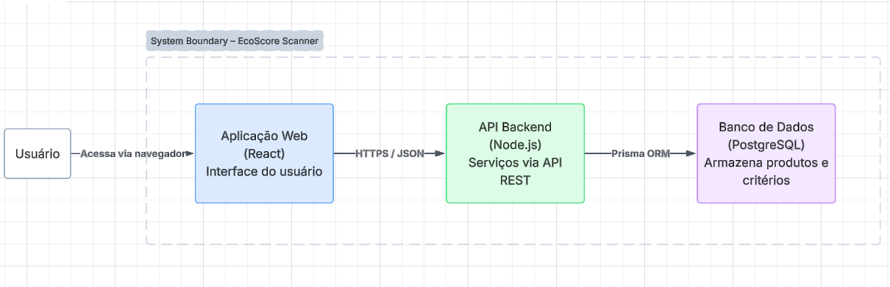

# Documentação de Arquitetura - EcoScore Scanner

Este documento detalha a estrutura arquitetural do EcoScore Scanner, justificando as escolhas tecnológicas e o modelo de organização do sistema.

## 1. Escolhas de Tecnologias

A stack tecnológica foi selecionada com foco em performance, escalabilidade e produtividade no desenvolvimento Full-stack:

* **Frontend:** React com Tailwind CSS. A escolha se deve à componentização eficiente e à vasta biblioteca de ecossistema para interfaces responsivas.
* **Backend:** Node.js com Express. Framework leve e de alta performance para APIs RESTful, ideal para lidar com múltiplas requisições assíncronas de consulta de produtos.
* **Persistência:** PostgreSQL e Prisma ORM. O PostgreSQL oferece robustez para dados relacionais, enquanto o Prisma garante segurança de tipos (Type-safe) e facilidade na modelagem do banco.
* **Infraestrutura:** Docker. Utilizado para a conteinerização da aplicação, garantindo que o ambiente de desenvolvimento seja idêntico ao de produção.

## 2. Projeto Arquitetural (C4 Model)

O sistema segue o modelo de arquitetura de containers, separando as responsabilidades de interface, lógica de negócio e armazenamento de dados.

### Nível 1: Diagrama de Contexto
O EcoScore Scanner interage com dois atores principais: o **Consumidor**, que realiza buscas e visualiza scores, e o **Administrador**, que gerencia o catálogo de produtos e parâmetros de cálculo.

### Nível 2: Diagrama de Containers
Abaixo está a representação visual dos containers que compõem o EcoScore Scanner e como eles se comunicam:

1.  **Web Application (React):** Interface onde o usuário interage com o sistema.
2.  **API Application (Node.js):** Responsável por processar a lógica de cálculo do Eco-Score e expor os endpoints de consulta e gestão.
3.  **Database (PostgreSQL):** Armazena as entidades de produtos, critérios de sustentabilidade e registros administrativos.

## 3. Justificativa do Modelo

A escolha pela arquitetura de **Containers/Client-Server** justifica-se pela separação clara entre a interface (Frontend) e a inteligência de dados (Backend). 

* **Manutenibilidade:** Permite atualizar a lógica de cálculo no backend sem impactar diretamente a interface do usuário.
* **Independência Tecnológica:** O uso de uma API REST permite que, no futuro, outros clientes (como um aplicativo mobile nativo) consumam os mesmos dados.
* **Facilidade de Testes:** A lógica do Eco-Score pode ser testada isoladamente no backend, garantindo que os requisitos de sustentabilidade da ODS 12 sejam atendidos com precisão.