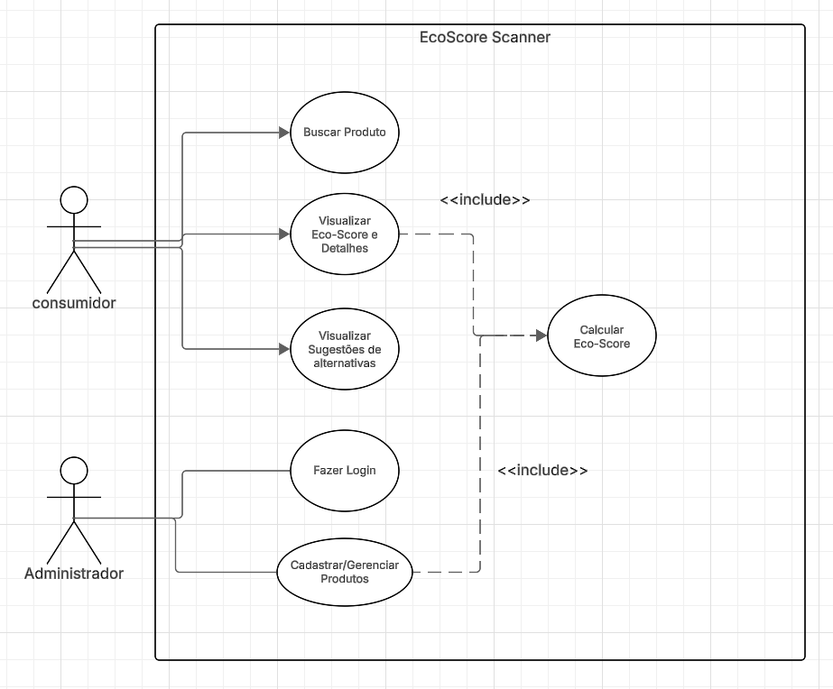

# Definição de Requisitos - EcoScore Scanner

## 1. Visão Geral
Este documento descreve os requisitos funcionais e não funcionais para o desenvolvimento do EcoScore Scanner, uma plataforma web voltada para a avaliação de sustentabilidade de produtos de consumo (ODS 12).

## 2. Requisitos Funcionais (RF)
Os Requisitos Funcionais definem as ações que o sistema deve ser capaz de executar.

* **[RF01] Cadastro de Produtos:** O sistema deve possuir um módulo administrativo que permita a inserção de produtos, detalhando seus atributos de embalagem, logística reversa e impacto ambiental.
* **[RF02] Motor de Cálculo do Eco-Score:** O backend deve calcular a nota final do produto (de 0 a 10) baseando-se em um algoritmo de pesos aplicado aos atributos cadastrados.
* **[RF03] Busca e Filtros:** O usuário consumidor deve ser capaz de buscar produtos pelo nome ou filtrá-los por categoria (ex: cosméticos, eletrônicos, vestuário).
* **[RF04] Visualização de Resultados:** O sistema deve exibir uma interface clara contendo a nota do produto e a justificativa para aquele "Eco-Score".
* **[RF05] Recomendação de Alternativas:** Ao exibir um produto com score baixo, o sistema deve sugerir automaticamente até três alternativas da mesma categoria que possuam um score mais alto.

## 3. Requisitos Não Funcionais (RNF)
Os Requisitos Não Funcionais definem as restrições e qualidades técnicas do sistema.

* **[RNF01] Tecnologias de Interface:** A interface de usuário (Frontend) deve ser responsiva e construída utilizando React em conjunto com Tailwind CSS para garantir agilidade na prototipação e carregamento rápido.
* **[RNF02] Arquitetura de Backend:** A lógica de cálculo e as APIs devem ser isoladas em um servidor construído com Node.js, garantindo escalabilidade e facilidade no tratamento de requisições assíncronas.
* **[RNF03] Persistência de Dados:** O sistema deve utilizar um banco de dados relacional em nuvem (como Neon DB / PostgreSQL) gerenciado através do Prisma ORM para mapeamento seguro das entidades do domínio.
* **[RNF04] Usabilidade:** A resposta para a busca de um produto deve ocorrer em menos de 2 segundos, garantindo uma boa experiência para o consumidor final.

## 4. Diagrama de Casos de Uso

Abaixo está a representação visual das interações entre os atores (Consumidor e Administrador) e as funcionalidades do EcoScore Scanner:

